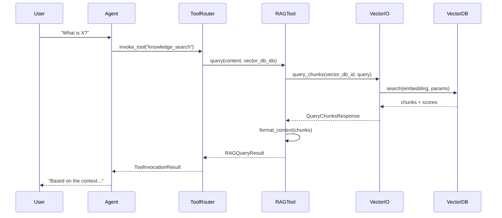

# Llama Stack RAG Query Methods - Complete Documentation

## 🎯 Overview

This documentation provides a comprehensive guide to the **3 RAG (Retrieval-Augmented Generation) query methods** available in Llama Stack. Unlike treating these as separate features, this guide emphasizes their **hierarchical relationships** and how they build upon each other.

## 🏗️ Key Discovery: Method Relationships

Based on analysis of the main Llama Stack codebase, the RAG methods form a **layered architecture**:

```
┌─────────────────────────────────────┐
│        Agent-based RAG              │ ← Conversational, automatic
│  (builtin::rag toolgroup)          │
├─────────────────────────────────────┤
│         RAG Tool API                │ ← Query processing, formatting  
│  (/tool-runtime/rag-tool/query)    │
├─────────────────────────────────────┤
│        Vector IO API                │ ← Direct database access
│   (/vector-io/query)               │
└─────────────────────────────────────┘
```

**Critical Insight**: Each higher-level method **uses** the lower-level methods internally:
- **Agent-based RAG** → calls **RAG Tool API** via [`ToolRuntimeRouter`](llama_stack/distribution/routers/tool_runtime.py)
- **RAG Tool API** → calls **Vector IO API** via [`self.vector_io_api.query_chunks()`](llama_stack/providers/inline/tool_runtime/rag/memory.py#L120-L131)

## 📚 Documentation Structure

### 🚀 Quick Start
- **[Main Guide](docs/rag-query-methods-guide.md)** - Complete overview with examples
- **[Method Relationships](docs/rag-methods/method-relationships.md)** - Detailed dependency analysis
- **[API Reference](docs/rag-methods/api-reference.md)** - Complete API documentation

### 💻 Working Examples
- **[Method Comparison](examples/rag-methods-relationships/01-method-comparison.py)** - See all 3 methods in action
- **[Migration Guide](examples/rag-methods-relationships/02-migration-guide.py)** - How to move between methods

### 📋 Planning Documents
- **[Comprehensive Plan](llama-stack-rag-query-methods-comprehensive-plan.md)** - Full implementation roadmap

## 🔍 The 3 RAG Query Methods

### 1. Vector IO API (Foundation)
**Purpose**: Direct vector database access with minimal abstraction

```python
response = client.vector_io.query_chunks(
    vector_db_id="my-db",
    query=[{"type": "text", "text": "machine learning"}],
    params={"max_chunks": 5, "mode": "vector"}
)
```

**When to use**: Custom implementations, maximum performance, research

### 2. RAG Tool API (Processing Layer)
**Purpose**: Built on Vector IO, adds query processing and context formatting

```python
result = client.tool_runtime.rag_tool.query(
    content=[{"type": "text", "text": "machine learning"}],
    vector_db_ids=["my-db"],
    query_config={"max_chunks": 5, "mode": "hybrid"}
)
```

**When to use**: Standard RAG workflows, balanced features and performance

### 3. Agent-based RAG (Integration Layer)
**Purpose**: Built on RAG Tool, adds conversational context and automation

```python
agent_config = {
    "toolgroups": [{"name": "builtin::rag", "args": {"vector_db_ids": ["my-db"]}}]
}
agent = Agent(client, agent_config)
response = agent.create_turn(messages, session_id)
```

**When to use**: Conversational applications, automatic RAG integration

## 🔄 Method Relationships in Detail

### Data Flow


### Code Relationships
- **Agent Layer**: [`AgentInstance`](llama_stack/providers/inline/agents/meta_reference/agent_instance.py) manages toolgroups
- **Routing Layer**: [`ToolRuntimeRouter`](llama_stack/distribution/routers/tool_runtime.py) connects agents to RAG tools
- **RAG Tool Layer**: [`MemoryToolRuntimeImpl`](llama_stack/providers/inline/tool_runtime/rag/memory.py) implements core RAG logic
- **Vector IO Layer**: [`VectorIO`](llama_stack/apis/vector_io/vector_io.py) provides database abstraction

## 🚀 Quick Start Examples

### Example 1: Progressive Enhancement
Start simple and add features:

```python
# Step 1: Direct vector search
chunks = client.vector_io.query_chunks(vector_db_id, query, params)

# Step 2: Add query processing  
result = client.tool_runtime.rag_tool.query(content, [vector_db_id], config)

# Step 3: Add conversational context
agent = Agent(client, {"toolgroups": [{"name": "builtin::rag", "args": {...}}]})
response = agent.create_turn(messages, session_id)
```

### Example 2: Method Selection
Choose based on requirements:

```python
# High performance, custom logic → Vector IO
if use_case == "high_performance":
    return client.vector_io.query_chunks(vector_db_id, query, params)

# Standard RAG features → RAG Tool  
elif use_case == "standard_rag":
    return client.tool_runtime.rag_tool.query(content, vector_db_ids, config)

# Conversational app → Agent
elif use_case == "chatbot":
    return agent.create_turn(messages, session_id)
```

## 📊 Method Comparison

| Aspect | Vector IO | RAG Tool | Agent RAG |
|--------|-----------|----------|-----------|
| **Complexity** | Low | Medium | High |
| **Performance** | Fastest | Medium | Slowest |
| **Features** | Minimal | Rich | Full |
| **Control** | Maximum | Balanced | Minimal |
| **Setup** | Simple | Moderate | Complex |

## 🔧 Migration Paths

### Upgrading (Add Features)
```
Vector IO → RAG Tool → Agent RAG
    ↓         ↓           ↓
  Speed   Features   Automation
```

### Downgrading (Optimize Performance)
```
Agent RAG → RAG Tool → Vector IO
    ↓         ↓           ↓
Automation Features    Speed
```

## 🎯 Decision Matrix

| Use Case | Recommended Method | Reason |
|----------|-------------------|---------|
| **Chatbot/Assistant** | Agent-based RAG | Automatic conversation handling |
| **API Endpoint** | RAG Tool API | Balanced features and performance |
| **High-Performance Service** | Vector IO API | Minimal overhead, maximum speed |
| **Research/Prototyping** | Vector IO API | Complete control over processing |
| **Enterprise Application** | RAG Tool API | Production-ready with standard features |

## 🛠️ Implementation Checklist

### For New Projects
- [ ] Identify performance requirements
- [ ] Determine feature needs (conversation, formatting, etc.)
- [ ] Choose appropriate method based on requirements
- [ ] Start with working example from this documentation
- [ ] Customize configuration for your use case

### For Existing Projects
- [ ] Analyze current bottlenecks
- [ ] Review method comparison table
- [ ] Plan migration path if needed
- [ ] Test new method alongside existing one
- [ ] Measure performance improvements

## 🔍 Debugging Guide

### Common Issues by Layer

**Vector IO Issues**:
- Check vector database registration
- Verify embedding model configuration
- Test database connectivity

**RAG Tool Issues**:
- Validate `vector_db_ids` parameter
- Check query configuration
- Review context formatting

**Agent Issues**:
- Verify toolgroup configuration
- Check session management
- Review agent instructions

### Debug Flow
```
1. Test Vector IO directly
2. Test RAG Tool with same parameters  
3. Test Agent with same configuration
4. Compare results at each layer
```

## 📈 Performance Optimization

### By Method
- **Vector IO**: Optimize database choice, embedding dimensions, search parameters
- **RAG Tool**: Use default query generator, optimize chunk templates, set token limits
- **Agent**: Use session persistence, configure max iterations, enable streaming

### General Tips
- Start with the simplest method that meets your needs
- Profile each layer to identify bottlenecks
- Consider caching for frequent queries
- Monitor token usage and costs

## 🤝 Contributing

This documentation is based on analysis of the main Llama Stack codebase. To contribute:

1. **Found an issue?** Check the relationships between methods first
2. **Adding examples?** Show how methods relate to each other
3. **Performance improvements?** Consider impact on all layers
4. **New features?** Document which layer they belong to

## 📞 Support

- **Documentation Issues**: Check method relationships first
- **Performance Problems**: Start debugging at the Vector IO layer
- **Integration Questions**: Review the migration guide
- **Feature Requests**: Consider which layer is most appropriate

## 🎉 Summary

The key insight from this documentation is that Llama Stack's RAG methods are **not independent alternatives** but rather **layers in a unified architecture**. Understanding these relationships helps you:

1. **Choose the right method** for your requirements
2. **Debug issues** by checking the appropriate layer  
3. **Optimize performance** at the right level
4. **Migrate smoothly** as requirements change

Each method builds upon the previous one, providing a **progressive enhancement path** from simple vector search to full conversational RAG systems.

---

**Start here**: [Main Guide](docs/rag-query-methods-guide.md) | **See it in action**: [Examples](examples/rag-methods-relationships/) | **Deep dive**: [Method Relationships](docs/rag-methods/method-relationships.md)