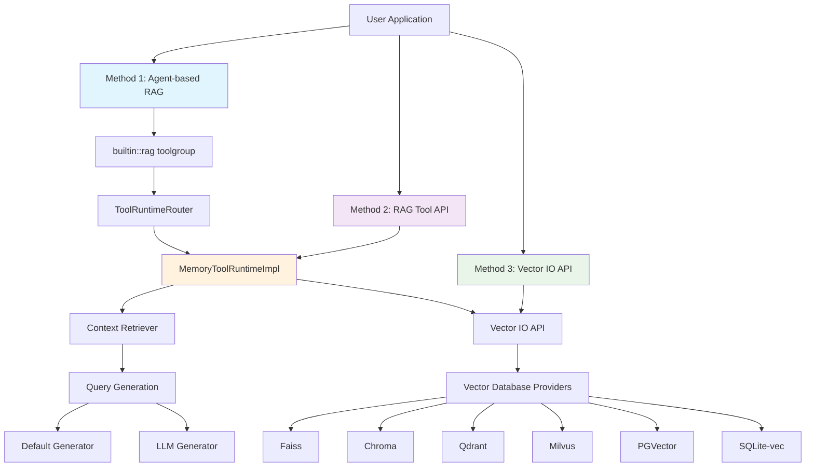
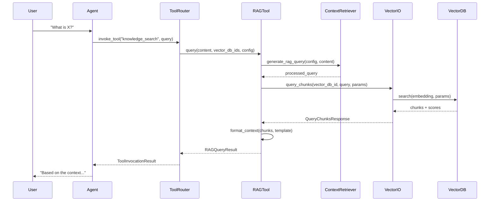
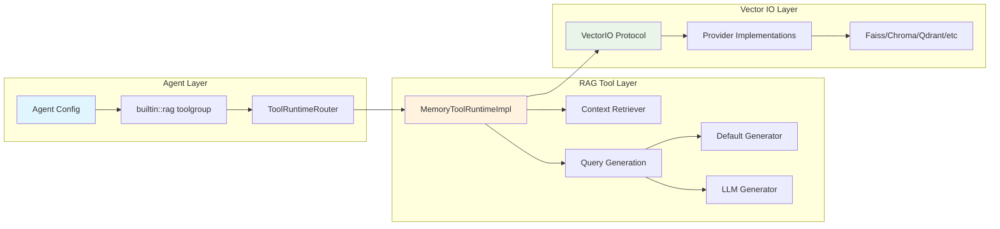

# Llama Stack RAG Query Methods - Comprehensive Documentation Plan

## Executive Summary

Based on extensive analysis of the Llama Stack main codebase, this document outlines a comprehensive plan for documenting all RAG (Retrieval-Augmented Generation) query and data retrieval methods. The analysis reveals **3 primary methods** with clear hierarchical relationships, where higher-level methods build upon lower-level ones.

## RAG Query Methods Architecture & Relationships

### Method Hierarchy and Dependencies



## Discovered RAG Query Methods

### 1. Agent-based RAG (Highest Level)
- **Purpose**: Conversational RAG through agent framework with `builtin::rag` toolgroup
- **Complexity**: High
- **Dependencies**: Uses RAG Tool API internally
- **Best For**: Interactive applications, multi-turn conversations, autonomous agents

**Key Implementation Details**:
- Agents configure `builtin::rag` toolgroup in their configuration
- Agent system automatically invokes RAG tools during conversation
- Supports session persistence and context management
- Integrates with agent workflow and event logging

**Relationship**: 
- **USES** → RAG Tool API via [`ToolRuntimeRouter`](llama_stack/distribution/routers/tool_runtime.py)
- **CALLS** → [`MemoryToolRuntimeImpl.invoke_tool()`](llama_stack/providers/inline/tool_runtime/rag/memory.py:206-225)

### 2. RAG Tool API (Middle Level)
- **Purpose**: High-level RAG interface with built-in query processing and context formatting
- **Complexity**: Medium
- **Dependencies**: Uses Vector IO API internally
- **Best For**: Direct RAG queries, custom applications, standardized workflows

**Key Implementation Details**:
- Endpoint: `/tool-runtime/rag-tool/query`
- Implements [`RAGToolRuntime`](llama_stack/apis/tools/rag_tool.py:147-166) protocol
- Core implementation: [`MemoryToolRuntimeImpl`](llama_stack/providers/inline/tool_runtime/rag/memory.py:52-225)
- Supports multiple query generation strategies
- Built-in context formatting and token management

**Relationship**:
- **USES** → Vector IO API via [`self.vector_io_api.query_chunks()`](llama_stack/providers/inline/tool_runtime/rag/memory.py:120-131)
- **CALLS** → [`generate_rag_query()`](llama_stack/providers/inline/tool_runtime/rag/context_retriever.py:23-38) for query processing
- **FORMATS** → Results using configurable chunk templates

### 3. Vector IO API (Lowest Level)
- **Purpose**: Direct vector database querying with minimal abstraction
- **Complexity**: Low-Medium
- **Dependencies**: Vector database providers only
- **Best For**: Custom RAG implementations, performance-critical applications, research

**Key Implementation Details**:
- Endpoint: `/vector-io/query`
- Implements [`VectorIO`](llama_stack/apis/vector_io/vector_io.py:238-275) protocol
- Direct interface to vector database providers
- Raw chunk retrieval with metadata
- Provider-agnostic implementation

**Relationship**:
- **FOUNDATION** → Used by all higher-level methods
- **IMPLEMENTS** → Provider-specific vector database interfaces
- **SUPPORTS** → Multiple search modes (vector, keyword, hybrid)

## Detailed Method Relationships

### Query Flow Architecture



### Component Dependencies



## Implementation Plan

### Phase 1: Document Method Relationships

#### 1.1 Architecture Overview Document
**File**: `docs/rag-methods/00-architecture-overview.md`

**Content Structure**:
- Method hierarchy and dependencies
- When to use each method
- Performance characteristics
- Migration paths between methods

#### 1.2 Method Relationship Diagrams
**File**: `docs/rag-methods/01-method-relationships.md`

**Content**:
- Detailed sequence diagrams
- Component dependency graphs
- Data flow illustrations
- Integration patterns

### Phase 2: Document Individual Methods

#### 2.1 Agent-based RAG Documentation
**File**: `docs/rag-methods/02-agent-based-rag.md`

**Key Relationships to Document**:
- How agents configure `builtin::rag` toolgroup
- Automatic tool invocation during conversations
- Integration with [`ToolRuntimeRouter`](llama_stack/distribution/routers/tool_runtime.py:28-60)
- Session management and context persistence

**Code Examples**:
```python
# Agent configuration with RAG
agent_config = {
    "toolgroups": [{
        "name": "builtin::rag",
        "args": {
            "vector_db_ids": [vector_db_id],
            "query_config": {
                "max_tokens_in_context": 2048,
                "max_chunks": 3
            }
        }
    }]
}
```

#### 2.2 RAG Tool API Documentation
**File**: `docs/rag-methods/03-rag-tool-api.md`

**Key Relationships to Document**:
- How it uses [`VectorIO.query_chunks()`](llama_stack/providers/inline/tool_runtime/rag/memory.py:120-131)
- Query generation via [`generate_rag_query()`](llama_stack/providers/inline/tool_runtime/rag/context_retriever.py:23-38)
- Context formatting and token management
- Integration with routing layer

**Code Examples**:
```python
# Direct RAG Tool usage
result = client.tool_runtime.rag_tool.query(
    content=[{"type": "text", "text": query}],
    vector_db_ids=[vector_db_id],
    query_config=RAGQueryConfig(
        max_chunks=5,
        mode="hybrid",
        ranker={"type": "rrf", "impact_factor": 60.0}
    )
)
```

#### 2.3 Vector IO API Documentation
**File**: `docs/rag-methods/04-vector-io-api.md`

**Key Relationships to Document**:
- Foundation for all higher-level methods
- Provider abstraction layer
- Direct database access patterns
- Performance considerations

**Code Examples**:
```python
# Direct Vector IO usage
response = client.vector_io.query_chunks(
    vector_db_id=vector_db_id,
    query=query_content,
    params={
        "max_chunks": 10,
        "mode": "vector",
        "score_threshold": 0.7
    }
)
```

### Phase 3: Advanced Integration Patterns

#### 3.1 Query Generation Strategies
**File**: `docs/rag-methods/advanced/05-query-generation.md`

**Content**:
- [`DefaultRAGQueryGeneratorConfig`](llama_stack/providers/inline/tool_runtime/rag/context_retriever.py:41-46) - Simple string concatenation
- [`LLMRAGQueryGeneratorConfig`](llama_stack/providers/inline/tool_runtime/rag/context_retriever.py:49-76) - LLM-powered query refinement
- Custom query generation patterns

#### 3.2 Context Formatting and Management
**File**: `docs/rag-methods/advanced/06-context-management.md`

**Content**:
- Chunk template system
- Token counting and limits
- Context assembly strategies
- Metadata handling

#### 3.3 Provider Integration Patterns
**File**: `docs/rag-methods/advanced/07-provider-integration.md**

**Content**:
- Vector database provider implementations
- Search mode configurations (vector, keyword, hybrid)
- Ranking algorithms (RRF, Weighted)
- Performance optimization per provider

### Phase 4: Practical Implementation Guide

#### 4.1 Working Examples
**Directory**: `examples/rag-methods-relationships/`

**Files**:
- `01-agent-to-rag-tool.py` - Show agent → RAG tool flow
- `02-rag-tool-to-vector-io.py` - Show RAG tool → Vector IO flow
- `03-custom-pipeline.py` - Build custom RAG using Vector IO
- `04-migration-examples.py` - Convert between methods
- `05-performance-comparison.py` - Benchmark all methods

#### 4.2 Integration Patterns
**File**: `docs/rag-methods/08-integration-patterns.md`

**Content**:
- When to use each method
- Migration strategies
- Performance trade-offs
- Debugging and troubleshooting

### Phase 5: Reference Documentation

#### 5.1 API Reference
**File**: `docs/rag-methods/09-api-reference.md`

**Content**:
- Complete parameter documentation
- Response schemas
- Error handling
- Configuration options

#### 5.2 Troubleshooting Guide
**File**: `docs/rag-methods/10-troubleshooting.md**

**Content**:
- Common integration issues
- Performance problems
- Configuration errors
- Debugging techniques

## Key Insights for Documentation

### Method Relationships Summary

1. **Agent-based RAG** is the highest-level interface that automatically manages RAG workflows
2. **RAG Tool API** provides the core RAG functionality with query processing and context formatting
3. **Vector IO API** is the foundation that all methods ultimately depend on
4. Each higher-level method **builds upon** and **extends** the lower-level methods
5. The architecture allows for **progressive complexity** - users can start simple and add sophistication

### Critical Implementation Details

1. **Routing Layer**: [`ToolRuntimeRouter`](llama_stack/distribution/routers/tool_runtime.py) connects agents to RAG tools
2. **Core Implementation**: [`MemoryToolRuntimeImpl`](llama_stack/providers/inline/tool_runtime/rag/memory.py) handles all RAG logic
3. **Query Processing**: [`generate_rag_query()`](llama_stack/providers/inline/tool_runtime/rag/context_retriever.py) supports multiple strategies
4. **Provider Abstraction**: Vector IO API enables multiple database backends
5. **Configuration Flexibility**: Each layer adds configuration options while maintaining compatibility

## Success Criteria

- Complete documentation of all 3 RAG query methods
- Clear explanation of method relationships and dependencies
- Working examples showing integration patterns
- Migration guides between methods
- Performance and use case guidance
- Troubleshooting and debugging information

This plan provides a comprehensive foundation for documenting the complete RAG query ecosystem in Llama Stack, emphasizing the relationships and dependencies between methods rather than treating them as isolated features.