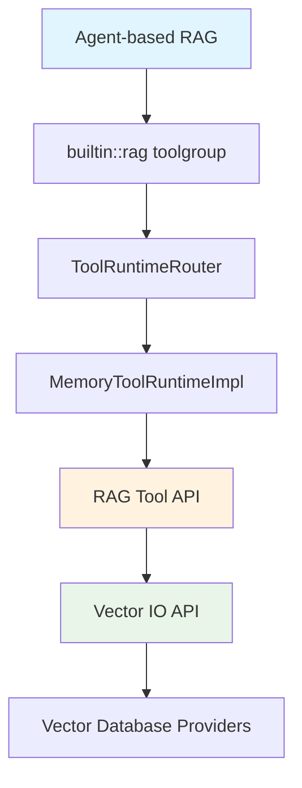
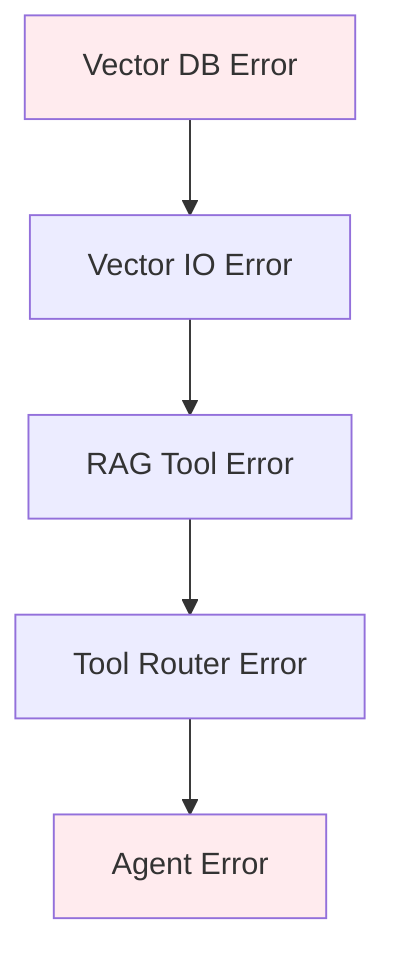

# RAG Methods API Reference

## Overview

This reference documents the APIs for all 3 RAG query methods in Llama Stack, emphasizing their relationships and how they build upon each other.

## Method Hierarchy



## 1. Vector IO API (Foundation Layer)

### Protocol Definition
**Location**: [`llama_stack/apis/vector_io/vector_io.py`](../../llama_stack/apis/vector_io/vector_io.py#L238-L275)

```python
@runtime_checkable
@trace_protocol
class VectorIO(Protocol):
    @webmethod(route="/vector-io/query", method="POST")
    async def query_chunks(
        self,
        vector_db_id: str,
        query: InterleavedContent,
        params: dict[str, Any] | None = None,
    ) -> QueryChunksResponse:
        """Query chunks from a vector database."""
```

### Request Parameters

| Parameter | Type | Required | Description |
|-----------|------|----------|-------------|
| `vector_db_id` | `str` | ✓ | Identifier of the vector database to query |
| `query` | `InterleavedContent` | ✓ | Query content (text, images, etc.) |
| `params` | `dict[str, Any]` | ✗ | Provider-specific query parameters |

### Common Parameters

| Parameter | Type | Default | Description |
|-----------|------|---------|-------------|
| `max_chunks` | `int` | 10 | Maximum number of chunks to return |
| `mode` | `str` | "vector" | Search mode: "vector", "keyword", "hybrid" |
| `score_threshold` | `float` | 0.0 | Minimum similarity score threshold |
| `ranker` | `dict` | None | Ranking configuration for hybrid search |

### Response Schema

```python
@json_schema_type
class QueryChunksResponse(BaseModel):
    chunks: list[Chunk]
    scores: list[float]
```

### Usage Example

```python
from llama_stack_client import LlamaStackClient

client = LlamaStackClient(base_url="http://localhost:8321")

response = client.vector_io.query_chunks(
    vector_db_id="my-knowledge-base",
    query=[{"type": "text", "text": "What is machine learning?"}],
    params={
        "max_chunks": 5,
        "mode": "hybrid",
        "score_threshold": 0.7,
        "ranker": {"type": "rrf", "impact_factor": 60.0}
    }
)

for chunk, score in zip(response.chunks, response.scores):
    print(f"Score: {score:.3f} - {chunk.content}")
```

### Provider Implementations

| Provider | Type | Location |
|----------|------|----------|
| Faiss | Inline | [`faiss.py`](../../llama_stack/providers/inline/vector_io/faiss/faiss.py) |
| Chroma | Remote | [`chroma.py`](../../llama_stack/providers/remote/vector_io/chroma/chroma.py) |
| Qdrant | Remote | [`qdrant.py`](../../llama_stack/providers/remote/vector_io/qdrant/qdrant.py) |
| Milvus | Remote | [`milvus.py`](../../llama_stack/providers/remote/vector_io/milvus/milvus.py) |
| PGVector | Remote | [`pgvector.py`](../../llama_stack/providers/remote/vector_io/pgvector/pgvector.py) |
| SQLite-vec | Inline | [`sqlite_vec.py`](../../llama_stack/providers/inline/vector_io/sqlite_vec/sqlite_vec.py) |

## 2. RAG Tool API (Processing Layer)

### Protocol Definition
**Location**: [`llama_stack/apis/tools/rag_tool.py`](../../llama_stack/apis/tools/rag_tool.py#L147-L166)

```python
@runtime_checkable
@trace_protocol
class RAGToolRuntime(Protocol):
    @webmethod(route="/tool-runtime/rag-tool/query", method="POST")
    async def query(
        self,
        content: InterleavedContent,
        vector_db_ids: list[str],
        query_config: RAGQueryConfig | None = None,
    ) -> RAGQueryResult:
        """Query the RAG system for context; typically invoked by the agent"""
```

### Implementation
**Location**: [`llama_stack/providers/inline/tool_runtime/rag/memory.py`](../../llama_stack/providers/inline/tool_runtime/rag/memory.py#L102-L178)

### Request Parameters

| Parameter | Type | Required | Description |
|-----------|------|----------|-------------|
| `content` | `InterleavedContent` | ✓ | Query content |
| `vector_db_ids` | `list[str]` | ✓ | List of vector database IDs to query |
| `query_config` | `RAGQueryConfig` | ✗ | Configuration for query processing |

### RAGQueryConfig Schema

```python
@json_schema_type
class RAGQueryConfig(BaseModel):
    query_generator_config: RAGQueryGeneratorConfig = DefaultRAGQueryGeneratorConfig()
    max_tokens_in_context: int = 4096
    max_chunks: int = 5
    chunk_template: str = "Result {index}\nContent: {chunk.content}\nMetadata: {metadata}\n"
    mode: str | None = None  # "vector", "keyword", "hybrid"
    ranker: Ranker | None = None
```

### Query Generator Configurations

#### Default Generator
```python
@json_schema_type
class DefaultRAGQueryGeneratorConfig(BaseModel):
    type: Literal["default"] = "default"
    separator: str = " "
```

#### LLM Generator
```python
@json_schema_type
class LLMRAGQueryGeneratorConfig(BaseModel):
    type: Literal["llm"] = "llm"
    model: str
    template: str
```

### Ranking Algorithms

#### RRF Ranker
```python
@json_schema_type
class RRFRanker(BaseModel):
    type: Literal["rrf"] = "rrf"
    impact_factor: float = 60.0  # Higher values favor top-ranked results
```

#### Weighted Ranker
```python
@json_schema_type
class WeightedRanker(BaseModel):
    type: Literal["weighted"] = "weighted"
    alpha: float = 0.5  # 0=keyword only, 1=vector only
```

### Response Schema

```python
@json_schema_type
class RAGQueryResult(BaseModel):
    content: InterleavedContent | None = None
    metadata: dict[str, Any] = Field(default_factory=dict)
```

### Usage Example

```python
from llama_stack_client import LlamaStackClient
from llama_stack_client.types.tools import RAGQueryConfig, RRFRanker

client = LlamaStackClient(base_url="http://localhost:8321")

result = client.tool_runtime.rag_tool.query(
    content=[{"type": "text", "text": "Explain machine learning concepts"}],
    vector_db_ids=["knowledge-base-1", "knowledge-base-2"],
    query_config=RAGQueryConfig(
        max_chunks=5,
        max_tokens_in_context=2048,
        mode="hybrid",
        ranker=RRFRanker(impact_factor=60.0),
        chunk_template="Source {index}: {chunk.content}\nRelevance: {metadata}\n---\n",
        query_generator_config={
            "type": "default",
            "separator": " "
        }
    )
)

# Context is automatically formatted and ready for LLM
if result.content:
    for item in result.content:
        if hasattr(item, 'text'):
            print(item.text)
```

### Relationship to Vector IO

The RAG Tool API **uses** Vector IO API internally:

```python
# From MemoryToolRuntimeImpl.query()
tasks = [
    self.vector_io_api.query_chunks(
        vector_db_id=vector_db_id,
        query=query,
        params={
            "mode": query_config.mode,
            "max_chunks": query_config.max_chunks,
            "score_threshold": 0.0,
            "ranker": query_config.ranker,
        },
    )
    for vector_db_id in vector_db_ids
]
results = await asyncio.gather(*tasks)
```

## 3. Agent-based RAG (Integration Layer)

### Configuration

Agent-based RAG is configured through the `builtin::rag` toolgroup:

```python
agent_config = {
    "model": "meta-llama/Llama-3.3-70B-Instruct",
    "instructions": "You are a helpful assistant with access to knowledge.",
    "toolgroups": [{
        "name": "builtin::rag",
        "args": {
            "vector_db_ids": ["knowledge-base-1"],
            "query_config": {
                "max_chunks": 5,
                "max_tokens_in_context": 2048,
                "mode": "hybrid",
                "ranker": {"type": "rrf", "impact_factor": 60.0}
            }
        }
    }]
}
```

### Toolgroup Arguments

| Parameter | Type | Required | Description |
|-----------|------|----------|-------------|
| `vector_db_ids` | `list[str]` | ✓ | Vector databases to search |
| `query_config` | `dict` | ✗ | RAG query configuration (same as RAG Tool API) |

### Implementation Flow

**Location**: [`llama_stack/distribution/routers/tool_runtime.py`](../../llama_stack/distribution/routers/tool_runtime.py#L28-L60)

```python
class ToolRuntimeRouter(ToolRuntime):
    class RagToolImpl(RAGToolRuntime):
        async def query(self, content, vector_db_ids, query_config):
            return await self.routing_table.get_provider_impl("knowledge_search").query(
                content, vector_db_ids, query_config
            )
```

### Usage Example

```python
from llama_stack_client import LlamaStackClient
from llama_stack_client.lib.agents.agent import Agent

client = LlamaStackClient(base_url="http://localhost:8321")

agent_config = {
    "model": "meta-llama/Llama-3.3-70B-Instruct",
    "instructions": "Use retrieved context to answer questions accurately.",
    "toolgroups": [{
        "name": "builtin::rag",
        "args": {
            "vector_db_ids": ["my-knowledge-base"],
            "query_config": {
                "max_chunks": 3,
                "mode": "hybrid"
            }
        }
    }]
}

agent = Agent(client, agent_config)
session_id = agent.create_session("rag_session")

# Agent automatically uses RAG when needed
response = agent.create_turn(
    messages=[{"role": "user", "content": "What is retrieval-augmented generation?"}],
    session_id=session_id
)

# Process agent response
for log in EventLogger().log(response):
    log.print()
```

### Relationship to RAG Tool

Agent-based RAG **uses** RAG Tool API through the routing layer:

```
Agent.create_turn()
  → AgentInstance._run_to_completion()
  → ToolRuntimeRouter.invoke_tool("knowledge_search")
  → MemoryToolRuntimeImpl.invoke_tool()
  → MemoryToolRuntimeImpl.query()  # RAG Tool API
```

## Error Handling

### Common Error Types

| Error | Layer | Cause | Solution |
|-------|-------|-------|---------|
| `ValueError: No vector DBs provided` | RAG Tool | Empty `vector_db_ids` | Provide at least one vector DB ID |
| `VectorDBNotFound` | Vector IO | Invalid `vector_db_id` | Check vector DB registration |
| `EmbeddingError` | Vector IO | Query embedding failed | Check embedding model configuration |
| `AgentToolError` | Agent | Tool invocation failed | Check toolgroup configuration |

### Error Propagation



### Error Handling Examples

```python
# Vector IO level
try:
    response = client.vector_io.query_chunks(vector_db_id, query, params)
except Exception as e:
    print(f"Vector IO error: {e}")

# RAG Tool level
try:
    result = client.tool_runtime.rag_tool.query(content, vector_db_ids, config)
except ValueError as e:
    print(f"RAG Tool configuration error: {e}")

# Agent level
try:
    response = agent.create_turn(messages, session_id)
except Exception as e:
    print(f"Agent error: {e}")
```

## Performance Considerations

### Method Comparison

| Method | Latency | Overhead | Control | Best For |
|--------|---------|----------|---------|----------|
| Vector IO | Low | Minimal | High | Custom implementations |
| RAG Tool | Medium | Moderate | Medium | Standard workflows |
| Agent RAG | High | Significant | Low | Conversational apps |

### Optimization Guidelines

#### Vector IO Optimizations
- Choose appropriate vector database for your scale
- Optimize embedding dimensions
- Use appropriate search modes
- Implement caching for frequent queries

#### RAG Tool Optimizations
- Use `DefaultRAGQueryGeneratorConfig` for speed
- Optimize `chunk_template` for token efficiency
- Set appropriate `max_tokens_in_context`
- Consider multi-database query parallelization

#### Agent Optimizations
- Use session persistence
- Configure appropriate `max_infer_iters`
- Enable streaming for real-time responses
- Optimize toolgroup configurations

## Migration Patterns

### Vector IO → RAG Tool
```python
# Before: Manual processing
response = client.vector_io.query_chunks(vector_db_id, query, params)
context = manual_format_chunks(response.chunks)

# After: Automatic processing
result = client.tool_runtime.rag_tool.query(content, [vector_db_id], config)
context = extract_formatted_content(result.content)
```

### RAG Tool → Agent
```python
# Before: Manual integration
result = client.tool_runtime.rag_tool.query(content, vector_db_ids, config)
context = extract_context(result)
response = client.inference.chat_completion(model, build_prompt(context, query))

# After: Automatic integration
agent_config = {"toolgroups": [{"name": "builtin::rag", "args": {...}}]}
agent = Agent(client, agent_config)
response = agent.create_turn(messages, session_id)
```

## Summary

The 3 RAG methods form a **layered architecture**:

1. **Vector IO API**: Foundation layer providing direct database access
2. **RAG Tool API**: Processing layer adding query generation and context formatting
3. **Agent-based RAG**: Integration layer adding conversational context and automation

Each layer builds upon the previous one, providing increasing levels of abstraction while maintaining access to lower-level functionality when needed.