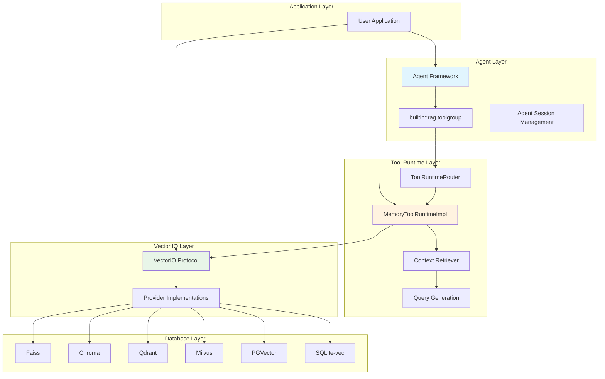
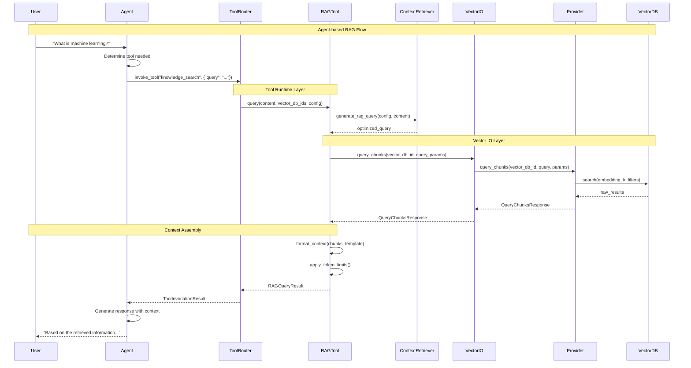
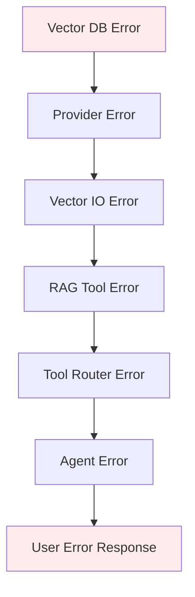
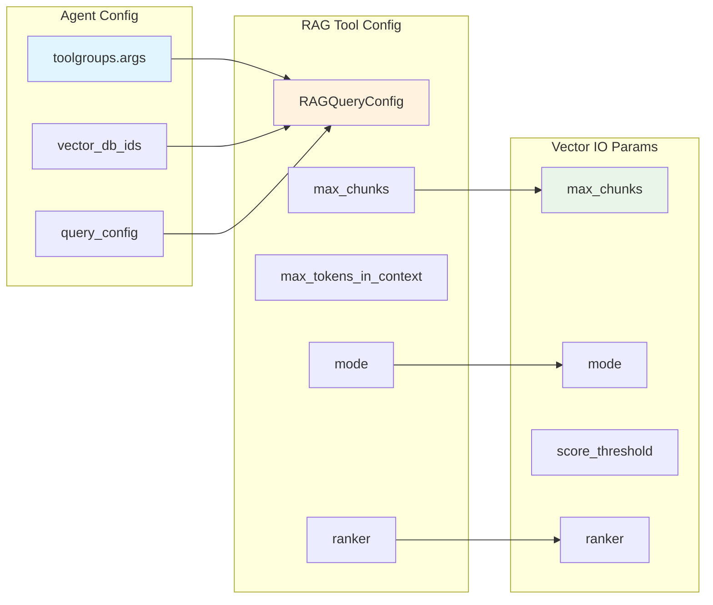

# RAG Method Relationships and Dependencies

## Overview

This document provides a detailed analysis of how the 3 RAG query methods in Llama Stack relate to and depend on each other. Understanding these relationships is crucial for choosing the right method and debugging issues.

## Architectural Layers



## Method Dependencies

### 1. Agent-based RAG Dependencies

**Direct Dependencies:**
- [`ToolRuntimeRouter`](../../llama_stack/distribution/routers/tool_runtime.py#L28-L60)
- Agent framework and session management
- Event logging and streaming infrastructure

**Indirect Dependencies:**
- RAG Tool API (via ToolRuntimeRouter)
- Vector IO API (via RAG Tool API)
- Vector database providers (via Vector IO API)

**Code Flow:**
```python
# Agent configuration triggers this flow:
Agent.create_turn() 
  → AgentInstance._run_to_completion()
  → ToolRuntimeRouter.invoke_tool("knowledge_search")
  → MemoryToolRuntimeImpl.invoke_tool()
  → MemoryToolRuntimeImpl.query()
  → VectorIO.query_chunks()
```

### 2. RAG Tool API Dependencies

**Direct Dependencies:**
- [`VectorIO`](../../llama_stack/apis/vector_io/vector_io.py#L238-L275) protocol
- [`Inference`](../../llama_stack/apis/inference) API (for LLM query generation)
- Context retriever and query generation modules

**Implementation Location:**
- Core: [`MemoryToolRuntimeImpl`](../../llama_stack/providers/inline/tool_runtime/rag/memory.py#L52-L225)
- Query processing: [`generate_rag_query()`](../../llama_stack/providers/inline/tool_runtime/rag/context_retriever.py#L23-L38)

**Key Integration Points:**
```python
# RAG Tool API calls Vector IO API:
async def query(self, content, vector_db_ids, query_config):
    # Generate optimized query
    query = await generate_rag_query(query_config.query_generator_config, content)
    
    # Call Vector IO for each database
    tasks = [
        self.vector_io_api.query_chunks(
            vector_db_id=vector_db_id,
            query=query,
            params={
                "mode": query_config.mode,
                "max_chunks": query_config.max_chunks,
                "ranker": query_config.ranker,
            }
        )
        for vector_db_id in vector_db_ids
    ]
    results = await asyncio.gather(*tasks)
```

### 3. Vector IO API Dependencies

**Direct Dependencies:**
- Vector database provider implementations
- Embedding models (for query vectorization)
- Database-specific client libraries

**Provider Implementations:**
- [`FaissVectorIOAdapter`](../../llama_stack/providers/inline/vector_io/faiss/faiss.py)
- [`ChromaVectorIOAdapter`](../../llama_stack/providers/remote/vector_io/chroma/chroma.py)
- [`QdrantVectorIOAdapter`](../../llama_stack/providers/remote/vector_io/qdrant/qdrant.py)
- [`MilvusVectorIOAdapter`](../../llama_stack/providers/remote/vector_io/milvus/milvus.py)
- [`PGVectorVectorIOAdapter`](../../llama_stack/providers/remote/vector_io/pgvector/pgvector.py)
- [`SQLiteVecVectorIOAdapter`](../../llama_stack/providers/inline/vector_io/sqlite_vec/sqlite_vec.py)

## Data Flow Analysis

### Complete Query Flow



### Error Propagation



## Configuration Inheritance

### How Configuration Flows Through Layers



### Configuration Examples

**Agent Level:**
```python
agent_config = {
    "toolgroups": [{
        "name": "builtin::rag",
        "args": {
            "vector_db_ids": ["kb1", "kb2"],
            "query_config": {
                "max_chunks": 5,
                "max_tokens_in_context": 2048,
                "mode": "hybrid",
                "ranker": {"type": "rrf", "impact_factor": 60.0}
            }
        }
    }]
}
```

**RAG Tool Level:**
```python
rag_config = RAGQueryConfig(
    max_chunks=5,
    max_tokens_in_context=2048,
    mode="hybrid",
    ranker=RRFRanker(impact_factor=60.0),
    chunk_template="Result {index}\nContent: {chunk.content}\n"
)
```

**Vector IO Level:**
```python
vector_params = {
    "max_chunks": 5,
    "mode": "hybrid",
    "score_threshold": 0.0,
    "ranker": {"type": "rrf", "impact_factor": 60.0}
}
```

## Performance Implications

### Method Overhead Comparison

| Method | Overhead | Reason |
|--------|----------|---------|
| Agent-based RAG | High | Agent processing, session management, event logging |
| RAG Tool API | Medium | Query generation, context formatting, multi-DB aggregation |
| Vector IO API | Low | Direct database access, minimal processing |

### Optimization Strategies by Layer

**Agent Layer Optimizations:**
- Use session persistence to avoid re-initialization
- Configure appropriate `max_infer_iters` to limit agent loops
- Enable streaming for real-time responses

**RAG Tool Layer Optimizations:**
- Use `DefaultRAGQueryGeneratorConfig` instead of LLM-based generation for speed
- Optimize `chunk_template` to minimize token usage
- Set appropriate `max_tokens_in_context` limits

**Vector IO Layer Optimizations:**
- Choose appropriate vector database for your use case
- Optimize embedding dimensions and chunk sizes
- Use appropriate search modes (vector vs hybrid)

## Debugging Relationships

### Common Issues and Their Sources

**Issue: No results returned**
```
Agent → ToolRouter → RAGTool → VectorIO → Provider → VectorDB
                                                    ↑
                                            Check here first
```

**Issue: Poor quality results**
```
Agent → ToolRouter → RAGTool → ContextRetriever
                              ↑
                        Check query generation
```

**Issue: Performance problems**
```
Agent → ToolRouter → RAGTool → VectorIO
↑                            ↑
Agent overhead              Database performance
```

### Debugging Tools

**Enable Debug Logging:**
```python
import logging
logging.getLogger("llama_stack").setLevel(logging.DEBUG)
```

**Check Each Layer:**
```python
# Test Vector IO directly
response = client.vector_io.query_chunks(vector_db_id, query, params)

# Test RAG Tool directly  
result = client.tool_runtime.rag_tool.query(content, vector_db_ids, config)

# Test Agent with RAG
agent_response = agent.create_turn(messages, session_id)
```

## Integration Patterns

### Pattern 1: Progressive Enhancement
Start with Vector IO, add RAG Tool features, then wrap in Agent:

```python
# Step 1: Vector IO
chunks = client.vector_io.query_chunks(vector_db_id, query, params)

# Step 2: Add RAG Tool processing
result = client.tool_runtime.rag_tool.query(content, vector_db_ids, config)

# Step 3: Wrap in Agent
agent = Agent(client, {"toolgroups": [{"name": "builtin::rag", "args": {...}}]})
```

### Pattern 2: Hybrid Approach
Use different methods for different use cases:

```python
# Fast lookups: Vector IO
if query_type == "simple_lookup":
    return client.vector_io.query_chunks(vector_db_id, query, params)

# Complex queries: RAG Tool
elif query_type == "complex_analysis":
    return client.tool_runtime.rag_tool.query(content, vector_db_ids, config)

# Conversational: Agent
elif query_type == "conversation":
    return agent.create_turn(messages, session_id)
```

### Pattern 3: Fallback Chain
Try methods in order of sophistication:

```python
try:
    # Try agent first for full context
    return agent.create_turn(messages, session_id)
except AgentError:
    try:
        # Fallback to RAG Tool
        return client.tool_runtime.rag_tool.query(content, vector_db_ids, config)
    except RAGToolError:
        # Final fallback to Vector IO
        return client.vector_io.query_chunks(vector_db_id, query, params)
```

## Summary

The 3 RAG methods form a **layered architecture** where:

1. **Vector IO API** provides the foundation with direct database access
2. **RAG Tool API** builds on Vector IO, adding query processing and context formatting
3. **Agent-based RAG** builds on RAG Tool, adding conversational context and automation

Understanding these relationships helps you:
- Choose the right method for your use case
- Debug issues by checking the appropriate layer
- Optimize performance at the right level
- Migrate between methods as requirements change

Each layer adds value while maintaining compatibility with the layers below, providing a flexible and powerful RAG ecosystem.