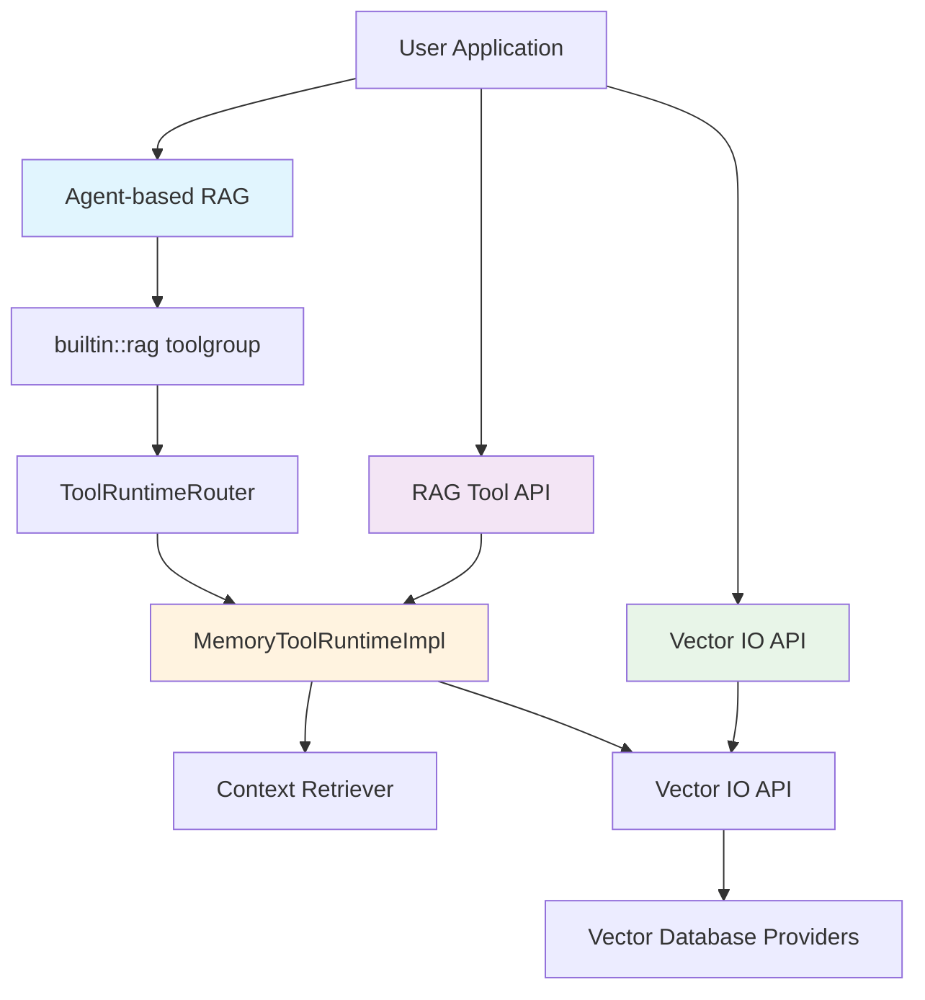
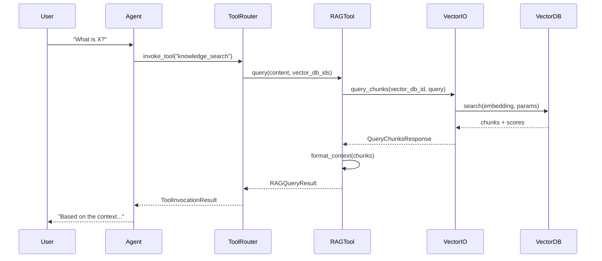

# Llama Stack RAG Query Methods - Complete Guide

## Overview

Llama Stack provides **3 distinct methods** for querying and retrieving data from RAG (Retrieval-Augmented Generation) systems. These methods form a **hierarchical architecture** where higher-level methods build upon lower-level ones, providing different levels of abstraction and control.

## Quick Method Comparison

| Method | Level | Complexity | Best For | Dependencies |
|--------|-------|------------|----------|--------------|
| [Agent-based RAG](#agent-based-rag) | High | High | Interactive apps, conversations | RAG Tool API |
| [RAG Tool API](#rag-tool-api) | Medium | Medium | Direct RAG queries, custom apps | Vector IO API |
| [Vector IO API](#vector-io-api) | Low | Low-Medium | Custom implementations, performance | Vector DB providers |

## Architecture Overview



## Method Relationships

### Dependency Chain
Each method builds upon the previous one:

1. **Vector IO API** (Foundation)
   - Direct vector database access
   - Provider abstraction layer
   - Raw chunk retrieval

2. **RAG Tool API** (Built on Vector IO)
   - **Uses**: [`VectorIO.query_chunks()`](../llama_stack/providers/inline/tool_runtime/rag/memory.py#L120-L131)
   - Adds query processing and context formatting
   - Implements [`RAGToolRuntime`](../llama_stack/apis/tools/rag_tool.py#L147-L166) protocol

3. **Agent-based RAG** (Built on RAG Tool)
   - **Uses**: RAG Tool API via [`ToolRuntimeRouter`](../llama_stack/distribution/routers/tool_runtime.py#L28-L60)
   - Adds conversational context and session management
   - Automatic tool invocation during agent workflows

### Data Flow



## Method Details

### Agent-based RAG

**Purpose**: Conversational RAG through agent framework with automatic tool invocation.

**Key Features**:
- Session persistence and multi-turn conversations
- Automatic RAG tool invocation during agent workflows
- Integration with agent event logging and streaming
- Built-in context management across conversation turns

**Implementation**: Uses `builtin::rag` toolgroup that routes through [`ToolRuntimeRouter`](../llama_stack/distribution/routers/tool_runtime.py) to the RAG Tool API.

**Example**:
```python
from llama_stack_client import LlamaStackClient
from llama_stack_client.lib.agents.agent import Agent

client = LlamaStackClient(base_url="http://localhost:8321")

# Configure agent with RAG toolgroup
agent_config = {
    "model": "meta-llama/Llama-3.3-70B-Instruct",
    "instructions": "You are a helpful assistant with access to knowledge.",
    "toolgroups": [{
        "name": "builtin::rag",
        "args": {
            "vector_db_ids": ["my-knowledge-base"],
            "query_config": {
                "max_tokens_in_context": 2048,
                "max_chunks": 5
            }
        }
    }]
}

agent = Agent(client, agent_config)
session_id = agent.create_session("rag_session")

# Agent automatically uses RAG when needed
response = agent.create_turn(
    messages=[{"role": "user", "content": "What are the key features of Llama Stack?"}],
    session_id=session_id
)
```

### RAG Tool API

**Purpose**: High-level RAG interface with built-in query processing and context formatting.

**Key Features**:
- Multiple query generation strategies (default, LLM-based)
- Configurable context formatting with templates
- Support for multiple vector databases in single query
- Advanced search modes (vector, keyword, hybrid)
- Built-in ranking algorithms (RRF, Weighted)

**Implementation**: Core implementation in [`MemoryToolRuntimeImpl`](../llama_stack/providers/inline/tool_runtime/rag/memory.py) which uses Vector IO API internally.

**Example**:
```python
from llama_stack_client import LlamaStackClient
from llama_stack_client.types.tools import RAGQueryConfig

client = LlamaStackClient(base_url="http://localhost:8321")

# Direct RAG Tool usage
result = client.tool_runtime.rag_tool.query(
    content=[{"type": "text", "text": "What is retrieval-augmented generation?"}],
    vector_db_ids=["knowledge-base-1", "knowledge-base-2"],
    query_config=RAGQueryConfig(
        max_chunks=5,
        max_tokens_in_context=2048,
        mode="hybrid",
        ranker={"type": "rrf", "impact_factor": 60.0},
        chunk_template="Result {index}\nContent: {chunk.content}\nSource: {metadata}\n"
    )
)

print(result.content)  # Formatted context ready for LLM
```

### Vector IO API

**Purpose**: Direct vector database querying with minimal abstraction.

**Key Features**:
- Provider-agnostic interface to vector databases
- Raw chunk retrieval with metadata and scores
- Custom parameter support for fine-tuned queries
- Direct control over search parameters
- Support for multiple vector database providers

**Implementation**: Implements [`VectorIO`](../llama_stack/apis/vector_io/vector_io.py#L238-L275) protocol with provider-specific backends.

**Example**:
```python
from llama_stack_client import LlamaStackClient

client = LlamaStackClient(base_url="http://localhost:8321")

# Direct Vector IO usage
response = client.vector_io.query_chunks(
    vector_db_id="my-vector-db",
    query=[{"type": "text", "text": "machine learning concepts"}],
    params={
        "max_chunks": 10,
        "mode": "vector",
        "score_threshold": 0.7,
        "ranker": {"type": "weighted", "alpha": 0.8}
    }
)

# Process raw chunks
for i, (chunk, score) in enumerate(zip(response.chunks, response.scores)):
    print(f"Chunk {i+1} (score: {score:.3f}): {chunk.content}")
    print(f"Metadata: {chunk.metadata}")
```

## When to Use Each Method

### Choose Agent-based RAG when:
- Building conversational applications
- Need session persistence across multiple turns
- Want automatic RAG integration in agent workflows
- Building interactive chatbots or assistants

### Choose RAG Tool API when:
- Need direct control over RAG queries
- Building custom applications with specific RAG requirements
- Want standardized query processing without agent overhead
- Integrating RAG into existing non-agent workflows

### Choose Vector IO API when:
- Building custom RAG implementations
- Need maximum performance and control
- Implementing research or experimental RAG patterns
- Require specific vector database optimizations

## Migration Between Methods

### From Vector IO to RAG Tool API
```python
# Vector IO approach
response = client.vector_io.query_chunks(vector_db_id, query, params)
chunks = response.chunks
# Manual context formatting...

# RAG Tool API approach
result = client.tool_runtime.rag_tool.query(
    content=query,
    vector_db_ids=[vector_db_id],
    query_config=RAGQueryConfig(**params)
)
# Context automatically formatted
```

### From RAG Tool to Agent-based
```python
# RAG Tool approach
result = client.tool_runtime.rag_tool.query(content, vector_db_ids, config)

# Agent-based approach
agent_config = {
    "toolgroups": [{"name": "builtin::rag", "args": {"vector_db_ids": vector_db_ids}}]
}
agent = Agent(client, agent_config)
# RAG automatically invoked during conversation
```

## Advanced Topics

- [Query Generation Strategies](advanced/query-generation.md)
- [Context Formatting and Templates](advanced/context-formatting.md)
- [Vector Database Providers](advanced/vector-providers.md)
- [Performance Optimization](advanced/performance.md)
- [Search Modes and Ranking](advanced/search-ranking.md)

## Troubleshooting

- [Common Issues](troubleshooting/common-issues.md)
- [Performance Problems](troubleshooting/performance.md)
- [Configuration Errors](troubleshooting/configuration.md)
- [Debugging Guide](troubleshooting/debugging.md)

## API Reference

- [RAG Tool API Reference](api-reference/rag-tool.md)
- [Vector IO API Reference](api-reference/vector-io.md)
- [Agent Configuration Reference](api-reference/agent-config.md)